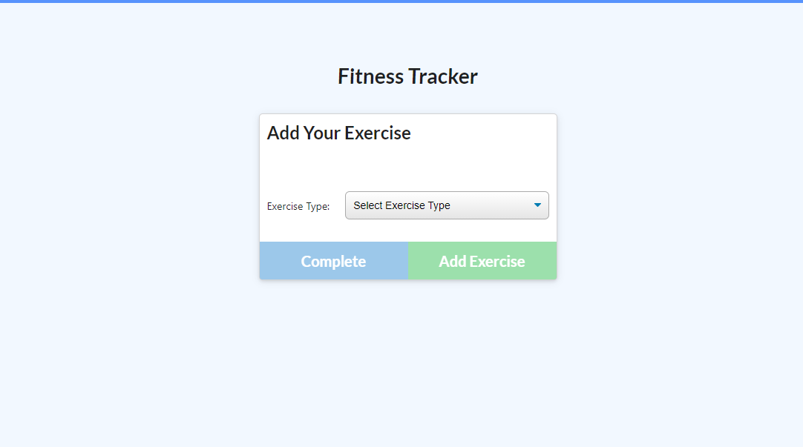
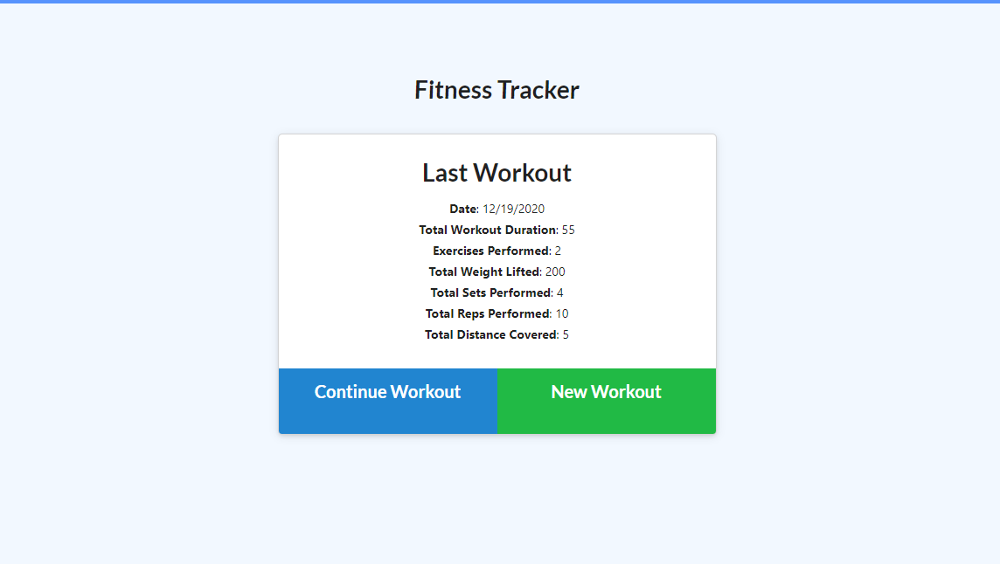
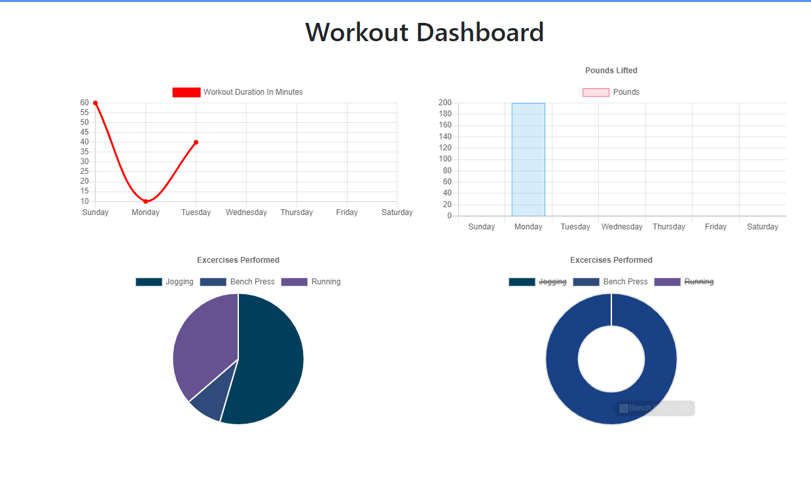

# :weight_lifting_woman: GitMovn: Fitness Tracker

Live Link: https://gitmovn-tracker.herokuapp.com/

## :cartwheeling: Description
```
As a user, I want to be able to view create and track daily workouts. 
I want to be able to log multiple exercises in a workout on a given day. 
I should also be able to track the name, type, weight, sets, reps, and duration of exercise. 
If the exercise is a cardio exercise, I should be able to track my distance traveled.
```
---

## :bicyclist: Technologies Used
- HTML/CSS
- JS
- Heroku
- MongoDB Atlas

## :swimmer: Screenshots



